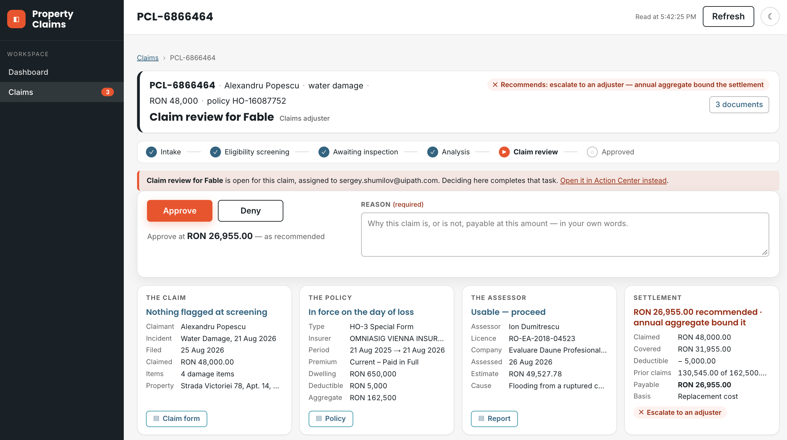

# Build the Process App (Block 6)

`PDD.md` §11 asks for the view the claims team lead has never had: every claim, where it is, how long it has been there, and what is waiting on a human — a work queue, an SLA and ageing view, and a per-claim drill-down. Today that view is a shared spreadsheet overwritten daily (§4.4, PP5); nobody can say how many claims are near their deadline. The PDD calls the replacement **a requirement, not a nicety**. This block builds it: a standalone **Coded Web App** with three screens — a portfolio dashboard, a searchable claims list, and one claim in full.

It comes after the hand-over for a reason. This app **reads what every other block produced** — the claim record, the case's own status words, the gate tasks in **Action Center** and the claim screen you built at 3f — so nothing it needs exists until the solution runs, and the solution it reads is the pinned one. And it ships **beside** the solution with its own publish and deploy, exactly as the **Coded Action App** does: an app provisioned inside the solution deploys as a shell and blocks every later redeploy once it moves on. A change to a chart must never cost a redeploy of the case.

??? quote "PDD §11 — the five views, verbatim"
    [Open §11 in the full document ↗](https://github.com/uipath-practice/PropertyClaimsSeeds/blob/main/PDD.md#11-reporting-and-monitoring-requirements)

    --8<-- "seeds/PDD.md:890:898"

## Decided for us

- **The three screens and the data inventory** — `6-process-app/layout.md`: a dashboard, a claims list, one claim. It also fixes what each screen may draw on — which columns of the record serve the portfolio, and what the case adds. The two mocks in `6-process-app/mocks/` fix the *intent*, not a pixel.
- **The record is the single source of the claim.** The case exposes no task payloads, so the record's header columns are the only thing a portfolio can count, filter and sort, and its payload columns are the claim screen. The case adds only what the record cannot know: per-stage status and SLA, and the pre-aggregated instance counts.
- **The currency rule** — `PDD.md` A2. Six countries, six currencies, no conversion anywhere in the process. Count claims freely; sum amounts per currency or not at all. A portfolio total in one currency is a number nobody can act on.
- **The vocabulary is your own case's.** Status words, stage names and SLAs are read from the record and the case, never typed into the app. A list typed in drifts the first time either changes.
- **A decision goes through the task, never the record.** From the claim page a handler completes the same Action Center task the case raised, with `contracts/review-task.md`'s payload, and the case writes the record — the same path as a decision made in Action Center. One writer, one shape, one audit trail. That is why the shared registration carries a task scope and **no** record-write scope.
- **Re-use the Action App's claim view.** The claim screen is the one you built at 3f, imported from its source — one claim view, two deployables — with the decision controls shown only while a gate task is open for that claim.
- **The visuals are yours** — which figures earn a card, which distributions earn a chart, the layout, the refresh. [Taste is still a requirement you have to state](../build/6-build-the-review-screens.md#decided-for-us).

## The prompt

````markdown title="Prompt — block 6 · Process App"
--8<-- "seeds/6-process-app/prompt.md"
````

Steps:

- [x] Read `PDD.md` §11, `6-process-app/layout.md`, `contracts/claim-entity.md`, `contracts/review-task.md` and `CONFIG.md`'s shared registration; load the uipath-coded-apps skill — its web-app path
- [x] Write `6-process-app/design.md` **before building**: each screen, what it shows and from which column or call, and the map from your record's status words to the labels a handler reads
- [x] Read the record schema and your own rows: the status vocabulary your case actually wrote, and which columns an in-flight claim does not have yet
- [x] Scaffold the Coded Web App at `Build/property-claims-<seat>/`; set its scopes to exactly the shared registration's list — no more
- [x] Share the claim view from `Build/claim-review-<seat>/src` by an alias — one source, two deployables — and take its stylesheet with it
- [x] Read the whole record set with a cursor loop; hydrate each pending task and join it to its claim on `claimId`
- [x] Build the three screens against your own records; serve locally; reconcile every dashboard figure against `uip df records list` before the first publish
- [x] Wire the in-app decision: complete the claim's own pending task with the contract's payload — outcome, outputs, the three identifiers replayed
- [x] Prove the bundle ships no fixtures and no localhost; `npm run build` → `uip codedapp pack` → `publish` (a Web app, no `-t Action`) → `deploy --folder-key <your seat folder> --client-id <the shared registration>`
- [x] Start a fresh claim per gate so a live task waits for the in-app decision; update `PROGRESS.md`

## Your checks, on the deployed URL

The agent proves the arithmetic without a browser: it runs the app's own aggregation over the rows the CLI read and diffs the two against an independent count. That reconciliation is a gate, and [every gate is a floor](../verify/index.md#testing-a-long-running-process). What the agent cannot do is sign in — a signed-in browser is a human's. So four checks are yours, and they close the block:

| Check                                                                                                  | What you should see                                                                                                                                                                                                                                  |
| ------------------------------------------------------------------------------------------------------ | ---------------------------------------------------------------------------------------------------------------------------------------------------------------------------------------------------------------------------------------------------- |
| Open the URL `deploy` printed, from your seat folder, signed in                                        | The dashboard renders on your own records. Its tiles equal the reconciliation the agent wrote — run its check and compare, or count by status with `uip df records list`                                                                             |
| Search one claim three ways — by claim id, by policy number, by claimant name — then once by nonsense | Each search finds it and says *how many of how many*; the nonsense search names what it looked for instead of a blank table                                                                                                                          |
| Open a settled claim, a refused claim and one still in flight                                          | The Action App's screen, unchanged; stages never entered marked as not reached; decision controls present **only** on the in-flight claim whose gate is open, with a link to the same task in Action Center beside them                              |
| Complete a gate task from the claim page — outcome, reason, submit                                     | `uip tasks get <id>` says `Completed`; the record carries the decision and the claim has moved on; *awaiting a human* drops by one on refresh                                                                                                        |

The agent left a fresh claim waiting at each gate for exactly this. Decide them from the app, not from the CLI — a task completed from the command line proves nothing about the screen.

=== "Dashboard"

    { .screenshot width="900" }

=== "Claims"

    { .screenshot width="900" }

=== "One claim"

    { .screenshot width="900" }

Read the screens the way a team lead would:

- **Every figure says where it came from or which rule it used.** The time-to-decision card says which calendar it counted; the currency card says why there is no total row. A figure with no source is a guess dressed as a number.
- **Who decided comes from the gate conditions, not the decision words.** The case's convergence write fills the decision columns on every claim, human or not. A gate counts as opened when the case's own condition opened it — a failed screening check, the review flag on the record — and the gates opened must equal the tasks ever raised. Ask your agent for that cross-check.
- **Where the case would have added something, the screen says so.** A scope not granted means the figure is computed from the record and the card says what is missing — never a blank panel, never sample data standing in for a failed call.

## What you learn about driving the agent

- **Three sources, and what each can say.** The record: business fields and the analysis payloads — everything a portfolio can count, filter and drill into. The case: per-stage status and SLA, and the pre-aggregated instance counts — what the record cannot know. The tasks: who is waiting, at which gate, since when. Every figure on the screen has exactly one of these behind it; make the agent name it.
- **One scope, one failure.** A scope asked for and not granted fails the **whole** token, silently, on the first call — sign-in bounces straight back, or every service fails at once. Read the registration in `CONFIG.md` before the code; the app asks for exactly that list. Adding a service means the scope has to exist on the registration first, and that is the operator's job, not the agent's.
- **Every list call is one page.** There is no option to ask for all, and a dashboard that reads one page lies confidently — a count looks like a count. The agent loops the cursor until there is no next page, then pages the table itself with *showing X–Y of Z*.
- **Absent is not null.** A column never written is missing from the row, not `null` — an in-flight claim is mostly absent columns. And the decision column has two shapes over a claim's life: the recommendation while the review gate is open, recommendation plus outcome after it closes. Read every column defensively, and key on the record's own flags, never on which keys happen to be present.
- **Completing a task replaces its payload.** Every writer replaces the whole payload, so the outcome, the outputs *and* the three identifiers go back together — a completed task must still know its claim. [The same fact shaped the Action App](../build/6-build-the-review-screens.md#what-agents-will-review); here it decides what the app sends.

`6-process-app/cookbook.md` carries the traps behind each of these, in the order an agent meets them.
