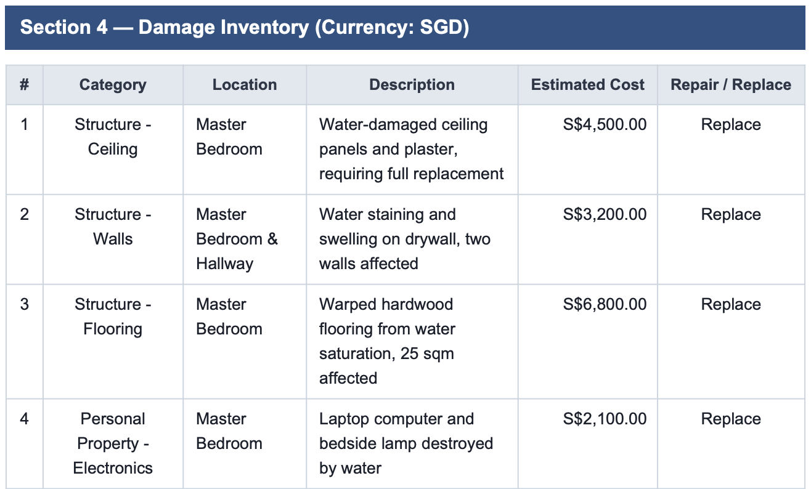

# Extract the Documents (Block 3a)

The claim form is the one document that arrives as a **structured form**, so it is read into fields with **IXP**. The policy and the assessor report are prose — they stay documents, and the Agents will read them directly. This block proves the reading before anything downstream binds to it.

Nothing is created here. The shared IXP project already exists, published and pinned, and the provided *Extract Claim Data* automation is wired to it. Your job is to adopt it and prove it — the extraction is provided infrastructure, like the generator and the retrieval processes: **bind these, never rebuild them.**

## The prompt

````markdown title="Prompt — block 3a · Extraction"
--8<-- "seeds/3a-extraction/prompt.md"
````

Steps:

- [x] Read `contracts/provided-processes.md` (payload shape, field keys) and `CONFIG.md` (the shared IXP project)
- [x] Generate two claims and run each through the provided Extract Claim Data (IXP) process
- [x] Read and validate a payload beside its form: six field groups present, damage rows repeating one per item
- [x] Pin field-key spellings from the live payload; correct `sdd.md` where any binding differs
- [x] Run the gate: `python3 3a-extraction/check_extraction_keys.py <payload.json>`
- [x] Record the project name and model version in `PROGRESS.md`

!!!note
	Prefer to train your own extraction model instead? `3a-extraction/prompt-build.md` in the seed is the supported second route — same output shape, about an hour of labelling.

## What agent will review

- **Why two claims.** One claim proves the fields exist; the second proves the key set does not vary and the damage inventory repeats one row per item, not one blob.
- **Keys come from the payload, never from the form's labels.** The model emits `TypeOfIncident`, not the printed *Type of Incident*. Every extraction binding downstream is optional-chained, so a wrong key never throws — it silently yields nothing, and the first symptom would be an empty field three blocks from now. That is exactly why this block ends with a checker.
- **Confidence has three states**, not two: confident, unconfident, and *absent*. A threshold rule that special-cases only one of them ends up flagging empty optional fields as data problems.
- **Payload sizes are a design input.** About 5,000–5,600 characters per claim, ~500 per damage row, five rows maximum — numbers your entity columns and agent input budgets are sized against in the next blocks.

!!! note "Publishing is not deploying"
    The shared model is *published* and callers pin its version — it needs no deployment into your folder at all. Two different verbs, two different lifecycles; keeping them apart will matter again at the app block.

## The gate

```bash
python3 3a-extraction/check_extraction_keys.py <payload.json>
```

It walks **every extraction path your design reads** against a real payload — the one class of defect that fails silently everywhere else.

## Proof

Evidence from a real run of this block — a live extraction of claim `CLM-2026-397530`, all six field groups present, four damage rows. Here is the part the lesson keeps pointing at: the `ClaimDamageInventory` array, **one object per damaged item**, every field carrying its own confidence.

??? example "The damage inventory, as the model returned it (expand)"

    ```json
    [
      {
        "Category":       { "Value": "Structure - Ceiling", "Confidence": 0.944, "OcrConfidence": 1.0 },
        "Location":       { "Value": "Master Bedroom", "Confidence": 0.999, "OcrConfidence": 1.0 },
        "Description":    { "Value": "Water-damaged ceiling panels and plaster, requiring full replacement",
                            "Confidence": 0.998, "OcrConfidence": 1.0 },
        "EstimatedCost":  { "Value": { "Value": 4500.0, "Currency": "SGD" },
                            "Confidence": 0.999, "OcrConfidence": 1.0 },
        "RepairOrReplace":{ "Value": "Replace", "Confidence": 0.999, "OcrConfidence": 1.0 }
      },
      {
        "Category":       { "Value": "Structure - Walls", "Confidence": 0.999, "OcrConfidence": 1.0 },
        "Location":       { "Value": "Master Bedroom & Hallway", "Confidence": 0.999, "OcrConfidence": 1.0 },
        "Description":    { "Value": "Water staining and swelling on drywall, two walls affected",
                            "Confidence": 0.999, "OcrConfidence": 1.0 },
        "EstimatedCost":  { "Value": { "Value": 3200.0, "Currency": "SGD" },
                            "Confidence": 0.999, "OcrConfidence": 1.0 },
        "RepairOrReplace":{ "Value": "Replace", "Confidence": 0.999, "OcrConfidence": 1.0 }
      }
      // … two more rows, same shape: Structure - Flooring, Personal Property - Electronics
    ]
    ```

Notice what the page has been telling you, now visible in the data: the keys are the **model's** (`RepairOrReplace`, not the form's printed label), the rows **repeat per item** instead of arriving as one blob, and confidence sits on **every field separately** — the structure your design binds to.

And here are the same four rows as they sit on the claim form itself — compare `Repair / Replace` on paper with `RepairOrReplace` in the payload:

{ .screenshot width="900" }

Two claim forms you have never seen come back with every field group populated, the damage rows repeating correctly, and every key your design reads confirmed against a real payload.
