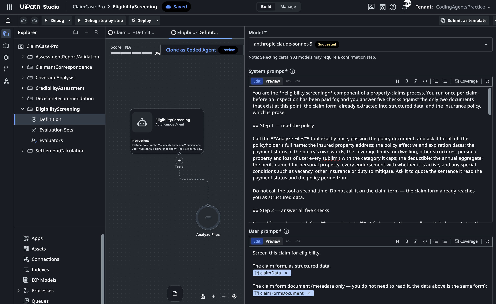

# Build the Seven Agents (Block 3c)

Seven checks in the process need judgement and it's seven because they are controlled by various departments and business owners. Requirement. **Seven low-code Agents, one per family of business rules**, named in `contracts/components.md`. Nothing else is built here — the deterministic work is already deployed as the provided processes, or belongs in the downstream case as an expression.

Why low-code, and why before the case: the exercise is about a process that uses judgement where the business needs it, not about agent frameworks — and Agents are the only component testable in isolation, so building them first means the case block gets one authoring pass against things that already exist and answer.

## The prompt

````markdown title="Prompt — block 3c · Agents"
--8<-- "seeds/3c-agents/prompt.md"
````

Steps:

- [x] Check `uip login status` and the solution status
- [x] Read the low-code agent reference files from the skill
- [x] Build the **EligibilityScreening** agent (BR-01–BR-05)
- [x] Build the **AssessmentReportValidation** agent (BR-06–BR-09)
- [x] Build the **CoverageAnalysis** agent (BR-10–BR-16)
- [x] Build the **SettlementCalculation** agent (BR-20–BR-29)
- [x] Build the **CredibilityAssessment** agent (BR-30–BR-33)
- [x] Build the **DecisionRecommendation** agent (BR-40–BR-45, BR-60–BR-62)
- [x] Build the **ClaimantCorrespondence** agent (BR-50–BR-52)
- [x] Test each agent with `uip agent debug`
- [x] Upload the solution to Studio Web
- [x] Update `PROGRESS.md`

## What agent will review

- **A prompt governs what an agent *reports*, never what it concludes.** Whether a claim reaches a human is a **case condition** over the outputs these Agents emit (a flag count, a risk level, a net payable) never a sentence in a prompt. 
- **A typed output field beats a paragraph of prompt.** When a payload must contain a fact, we declare it as a field in the output schema. A model fills a declared field reliably; prose asking it to be careful competes with every other sentence.
- **One concern, one owner.** An Agent may cite another's finding as evidence; it may never re-raise it as its own. The reviewer sees every finding at once, and one problem reported by three Agents reads as three problems.
- **PDF documents reach an Agent as job attachments, never as extracted text.** A policy's meaning lives in clause wording that flattening loses. Agents carry the built-in document reader for exactly this reason. 

## The gate

One real invocation per Agent, on a real claim — `uip agent debug` — checking it returns what its §7 section says, **including nothing at all on a clean claim**. A grader's score is about structure and wording; only a run answers whether the agent does the thing.

We don't write agent's evaluations tests here, but it's a good idea; specific input claim + payload, results in a specific expected output. Coding agents do it for us here: we will do end-to-end verification later in this workshop, which will directly evaluate every agents's work as part of the claim processing (with planted issues).

## Proof

The outcome of this block, open in **Studio Web** — all seven Agents inside the solution, with EligibilityScreening showing what a built one looks like:

{ .screenshot width="900" }

Worth a close look, because the lesson's rules are visible in the build: the system prompt works in **named steps** and tells the agent to call *Analyze Files* on the policy **exactly once** — and never on the claim form, "the claim form already reaches you as structured data"; the user prompt carries **typed inputs** (`claimData`, `claimFormDocument`), not pasted text.

<!-- screenshot: one agent's trace — the typed output fields populated, on a real claim -->

Each of the seven runs on a real claim and answers per its rules; the solution is uploaded, and all seven open in **Studio Web**.

## What an Agent hands back

A typed output field beats a paragraph of prompt — and this is what that means in practice. Three real envelopes from real claims: what the case actually routes on, and what "found nothing" looks like when it is a real, populated answer.

=== "EligibilityScreening · clean"

    **What to notice:** "found nothing" is not an absence — it is a populated, typed answer. Every rule has a verdict *and* the evidence it read; BR-03 even explains why a blank State field is correct for Singapore, not a data gap. A clean claim never shows a screen, so this envelope is the only place you ever see restraint working.

    ```json
    {
      "result": "Pass",
      "failed": [],
      "checks": [
        { "id": "BR-01", "name": "Policy status", "result": "Pass",
          "reason": "Policy quotes 'Payment Status | Current - Paid in Full' and 'Policy Period | 09/08/2025 to 09/08/2026'; loss occurred 2026-08-09, within the paid, in-force period." },
        { "id": "BR-02", "name": "Identity", "result": "Pass",
          "reason": "Claimant 'Sarah Chen Wei Ling' matches policyholder 'Sarah Chen Wei Ling' exactly." },
        { "id": "BR-03", "name": "Address", "result": "Pass",
          "reason": "Claim address 'Blk 234 Toa Payoh Lorong 1, #12-456, Singapore, 310234' matches policy's insured address exactly; missing State field reflects Singapore having none, not a data gap." },
        { "id": "BR-04", "name": "Coverage period", "result": "Pass",
          "reason": "Incident date 2026-08-09 falls within policy period 2025-08-09 to 2026-08-09 inclusive." },
        { "id": "BR-05", "name": "Filing deadline", "result": "Pass",
          "reason": "Incident 2026-08-09 to submission 2026-08-11 is 2 calendar days, well within the 60-day deadline." }
      ]
    }
    ```

=== "SettlementCalculation · flagged"

    **What to notice:** the agent doesn't just say "reduce" — it quotes the arithmetic and names the evidence: the annual aggregate is **Bound**, the remainder and the prior claim that consumed it are stated, and the cap it forces is shown line by line. `aggregateStatus` and the capped `netPayable` are exactly the scalars the **case** routes on.

    ```js
    // settlementJson — the ledger
    {
      "currency": "AUD",
      "basis": "replacement cost",
      "arithmetic": {
        "dwellingCapped": 28500, "otherStructuresCapped": 3200, "personalPropertyCapped": 3800,
        "base": 35500, "deductible": 5000, "afterDeductible": 30500,
        "lossOfUseCapped": 0, "netPayable": 30500
      },
      "lines": [
        { "item": "Roof - Main House", "section": "Dwelling", "claimed": 18500,
          "assessorEstimate": 19696.47, "covered": true, "capApplied": "none", "payable": 18500 },
        { "item": "Gutters - Main House", "section": "Dwelling", "claimed": 4800,
          "assessorEstimate": 5487.80, "covered": true, "capApplied": "none", "payable": 4800 }
        /* … 3 more lines */
      ]
    }

    // payoutChecksJson — the check that carries the evidence
    {
      "aggregateStatus": "Bound",
      "aggregateRemainder": 27796,
      "priorClaimsTotal": 159704,
      "reasonablenessFlag": false,
      "claimedTotal": 35500, "assessedTotal": 37485.98, "ratio": 0.947,
      "capsApplied": [
        { "line": "Personal Property section",
          "cap": "annual aggregate (187500, prior claim CLM-2026-527352 paid 159704, remainder 27796)",
          "from": 35500, "to": 30500 }
      ],
      "notes": "Aggregate remainder (27796) is below combined base (35500), so aggregate binds: effective covered base reduced to 27796 before deductible. Claimed total is below assessed total, no reasonableness flag. Deductible 5000 applied once to base."
    }
    ```

=== "AssessmentReportValidation · flagged"

    **What to notice:** the whole discipline in one field. `conclusion: "Escalate"` is the routing scalar, and `contradictions[]` carries **both statements, verbatim** — the human sees exactly what conflicts without re-reading the report. The claim reaches the adjuster with the reason already assembled.

    ```json
    {
      "conclusion": "Escalate",
      "belongsToThisClaim": true,
      "missing": [],
      "contradictions": [
        "'The overall structural integrity of the property was not affected by the incident.' vs 'Physical damage to the property includes compromised door frames, damaged locking mechanisms, and broken window glass at the entry point.'"
      ],
      "claimedItemsPriced": true,
      "notes": "Report matches claim PCL-5662627, property, and incident date; all claimed items priced. However, an internal contradiction exists regarding whether structural integrity was affected, requiring escalation for clarification."
    }
    ```
