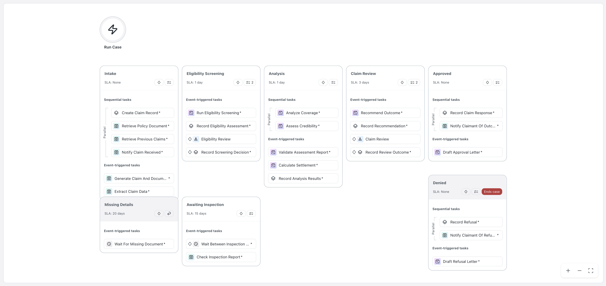
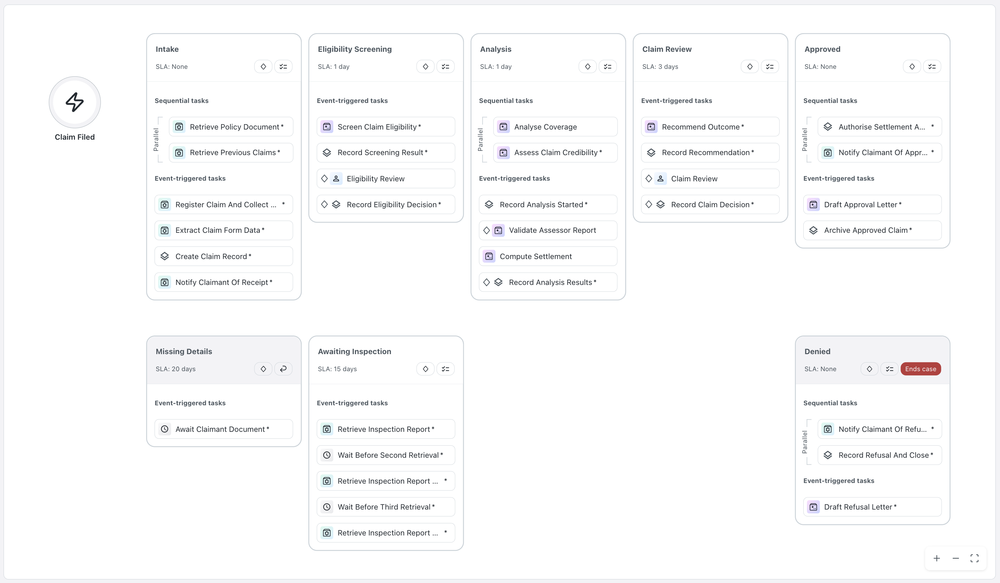
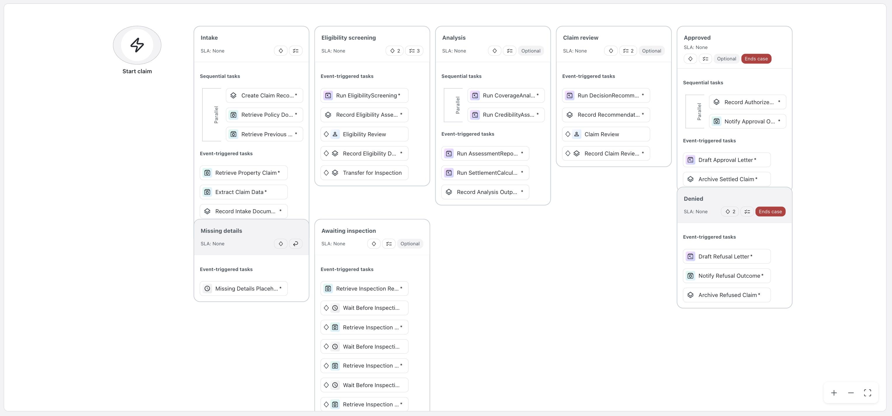
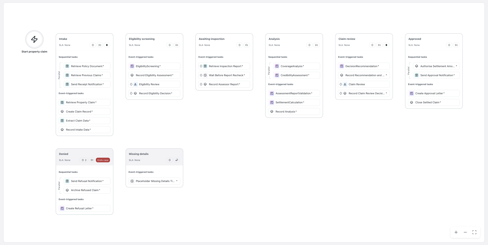

# Author the Case (Block 3d)

The **Maestro Case Plan** binds everything you have built into one lifecycle — and this block deliberately stops at *authored and validated*, never run. The split matters: a plan that will not validate is a **design** problem; a plan that validates and then misbehaves is a **binding** problem. Kept apart, each is debugged where it lives — merged, the second gets debugged through redeploy cycles at several minutes each.

*The Work That Remains* describes exactly this shape, with an insurance claim as its own example: the **case** owns the lifecycle (opened, investigating, decided, closed); the stable stretches inside a stage run as declared **workflow** on rails, exact and tokenless; and where a stretch needs judgement, an agent takes one well-defined **goal** and finds the path at runtime. The three nest — you are building all three at once.

## First: register the Action App

The two human gates are action tasks bound to the app's **known contract**. So the app is registered *now*: standalone, beside the solution, **an empty page plus its schema**. That is enough for the case to wire both gateways and prove every route from the command line; the screens replace the empty page at 3f and the case is never touched again.

The App contract is settled once and not revisited, because changing it after the case binds **breaks the bindings at both gateways**. And the app build is a natural piece to delegate to a sub-agent: one contract file defines its entire I/O, nothing about it needs this block's context.

## The prompt

````markdown title="Prompt — block 3d · The case"
--8<-- "seeds/3d-case/prompt.md"
````

Steps:

- [x] Scaffold and deploy the Coded Action App `claim-review-<seat>` (beside the solution, stand-alone)
- [x] Build the case plan (`caseplan.json`) from `sdd.md`
- [x] Validate the case plan (`uip maestro case validate` + `check_caseplan.py`)
- [x] Upload the solution to Studio Web
- [x] Update `PROGRESS.md`

## What agent will review

- **Agent will validate two outcomes at each gate.** Two gates × two answers = the four routes the next block proves.
- **A gate opens because something needs a person, never as a formality.** A clean claim raises no task at all, and the happy path still writes down that it was decided automatically, explicitly. 
- **Fail towards the human.** Unset, empty and false must all *open* a gate. A condition that quietly closes one on missing data is the most expensive kind of correct-looking plan.

!!! note "When the task is larger than the context"
    This is the largest build in the workshop, so context size matters more than ever. Models differ in window size and in how they behave as the window fills: some compensate for smaller windows remarkably well. What fits a large task into any window: 
    
	- write as you go (compaction preserves only what is already written) 
    - names and keys into `PROGRESS.md` the moment they exist (post-compact can read it)
    - self-contained pieces delegated to a subagent (the app, in this block) 
    - clear and resume from files
    
    There will always be tasks larger than the largest context of the day; the craft is working so the limit doesn't matter.

## The gates

```bash
uip maestro case validate
python3 3d-case/check_caseplan.py
```

The full validator, then the shipped checker. 

The validator's errors are runtime failures spelled out in advance: a gate you route around does not go away, it fails later at several minutes per deploy cycle. 

## Proof

**The diagram is a deliverable.** A case plan a business user cannot follow is a case plan nobody signs. Open it in **Studio Web** and read it as they would.

Four case plans, four different models, one PDD — the stages and gates the process requires are in every one of them, and everything else differs:

=== "Sonnet 5"

    { .screenshot width="900" }

=== "Opus 5"

    { .screenshot width="900" }

=== "GPT-5.5"

    { .screenshot width="900" }

=== "GPT-5.6 Terra"

    { .screenshot width="900" }

The design was each model's own — the PDD names no products and no stages, so the shape is a decision, not a transcription. What makes all four *compatible* solutions is the pinned contracts underneath; what makes them different is everything the contracts deliberately leave to the designer. You'll see the same effect on the app screens at 3f.
