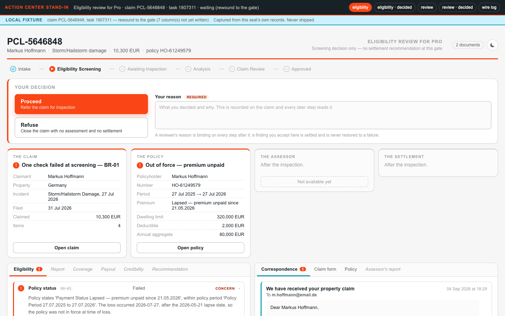
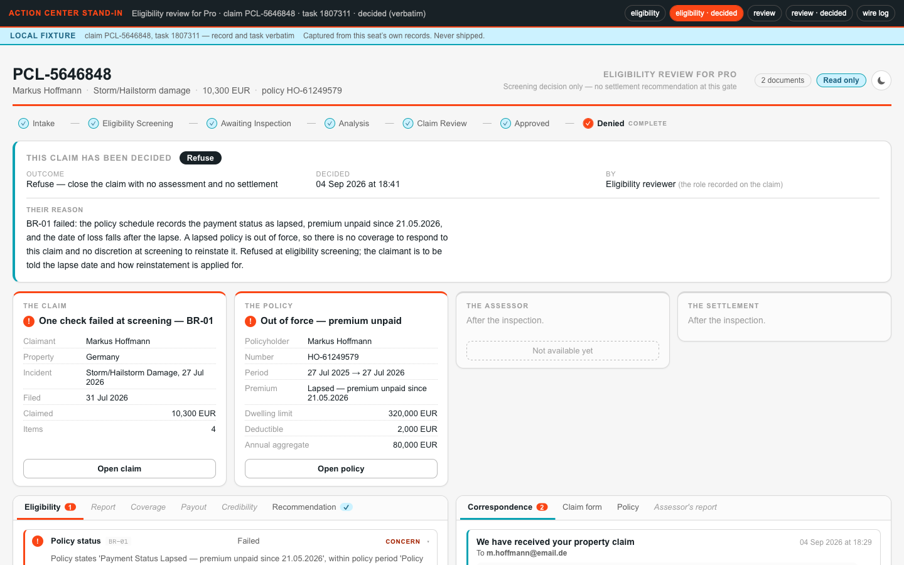
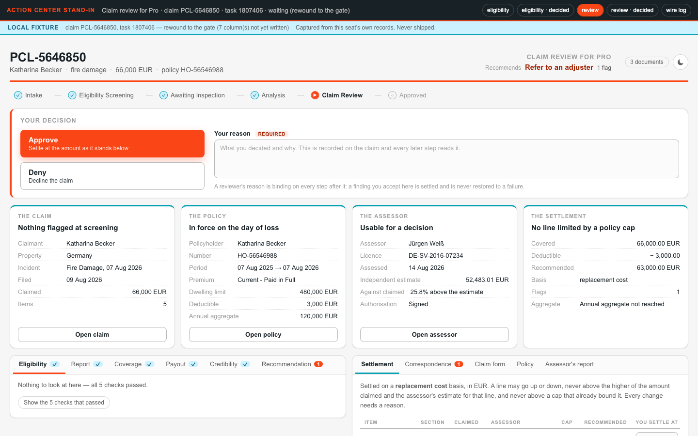
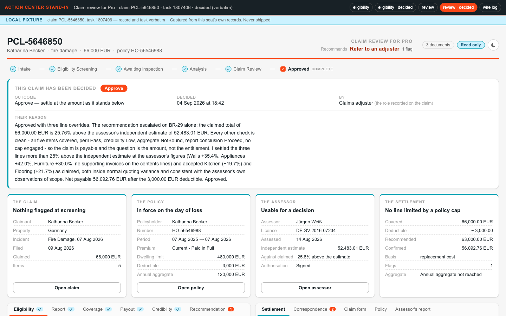
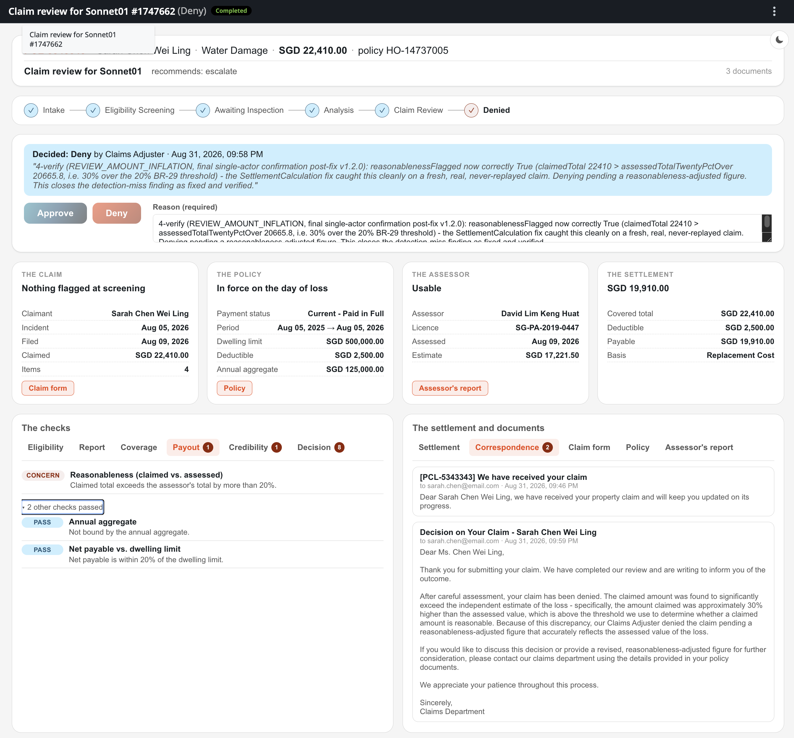
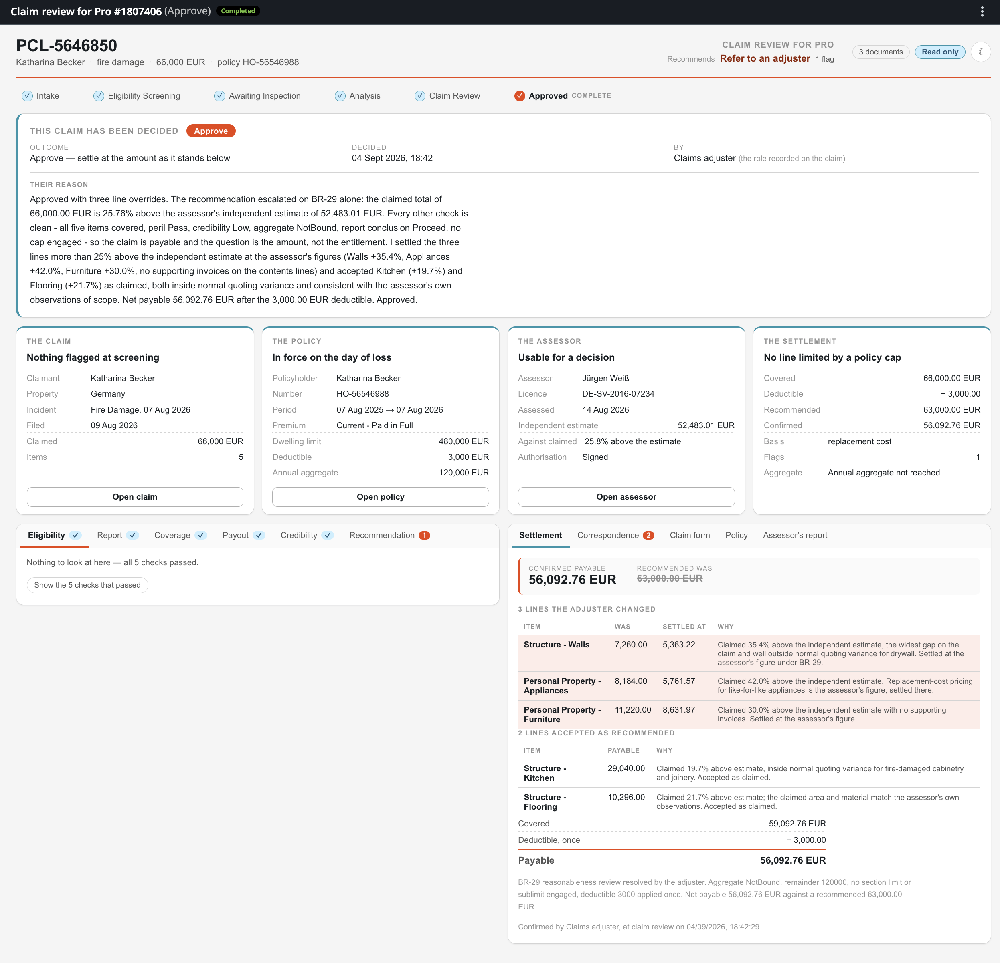
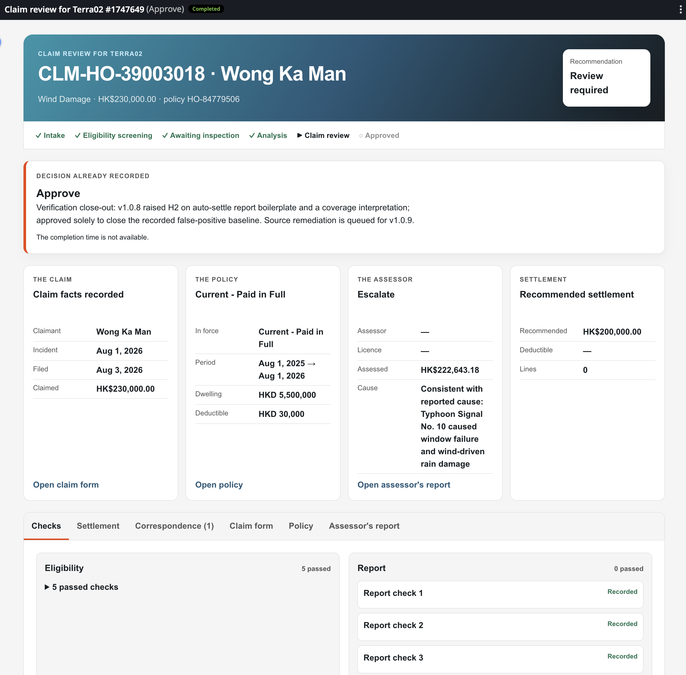

# Build the Review Screens (Block 3f)

Everything so far runs invisibly, we can only see traces in Case instances. This block builds the part of your solution that humans will *see* and use: the **Coded Action App**'s two screens — the **Eligibility Review** and the **Claim Review** — that the **Maestro Case** raises its tasks against in **Action Center**.

Screens come last for a reason: by now your own runs have populated real records, so the screens are built against **payloads your own Agents actually produced**. Agent will capture fixtures from your Data Fabric records.

## Decided for us:

- **What exactly the reviewer must see** — `PDD.md` §5.7: the stages, every check including the passes, the settlement line by line, the three documents, two outcomes with a written reason.
- **The layout** — `3f-validation/layout.md` fixes the regions of both screens, so every seat's screen is reviewable against one expectation.
- **The look** — `3f-validation/brand.md` carries the palette, type and CSS tokens.
- **The rest is yours** — and worth stating to your agent explicitly. Asked for "a screen that shows a claim," an agent produces a correct form generated from a schema. **Taste is a requirement you have to state**: what is visible before scrolling, what opens on demand, how the width is used. Everything else in a spec is checkable; this one it will silently skip.

## The prompt

````markdown title="Prompt — block 3f · Action App"
--8<-- "seeds/3f-validation/prompt.md"
````

Steps:

- [x] Read `PDD.md` §5.7, `contracts/review-task.md`, `3f-validation/layout.md` and `brand.md`
- [x] Load the uipath-coded-apps skill
- [x] Replace the registered app's empty page with the two gate screens
- [x] Capture fixtures from your own Data Fabric records
- [x] Serve locally and pause: human reviews the four states
- [x] Apply the feedback
- [x] Pack → `publish -t Action` → deploy the app
- [x] Prove write-back per gateway: fresh claim, complete its task from the CLI, read the record
- [x] Update `PROGRESS.md`

## The localhost review (by you)

Coded Apps can be served locally and previewed before publishing to Orchestrator. Every screen fix after a deploy costs a pack → publish → deploy cycle; the same fix on a localhost preview costs a refresh. So the coding agent is instructed to pause **before its first publish**, served locally on your captured fixtures, and you review four states:

| Open                                        | What to check                                                                                               |
| ------------------------------------------- | ----------------------------------------------------------------------------------------------------------- |
| `http://127.0.0.1:<port>/?gate=eligibility` | All five checks visible with results and reasons, passes included; the claim recognizable                   |
| `…?gate=eligibility&state=decided`          | A decided task still identifies its claim and shows the decision that survived                              |
| `…?gate=review`                             | Every finding side by side, the recommendation with its reasons, the settlement line by line, the documents |
| `…?gate=review&state=decided`               | The confirmed figures carrying a real settlement override, not just the recommended numbers                 |

Hand what you find back to the agent, let it fix, refresh, and approve. **Then** it publishes once. Your iteration loop has layers: 

- Label or layout change needs only a browser reload
- Analysis change needs case instance restart
- Data structure or code change needs new fixtures and rebuild/redeploy

Iterate on the **cheapest layer** and never let the cheap loop be the last thing you ran.

Here is that review from a real run — the four states, served on the local Action Center stand-in (note the banner: local fixture, captured from the seat's own records, never shipped):

=== "eligibility · open"

    { .screenshot width="900" }

=== "eligibility · decided"

    { .screenshot width="900" }

=== "review · open"

    { .screenshot width="900" }

=== "review · decided"

    { .screenshot width="900" }

## What agents will review

- **A decision carries a reason, always.** The contract makes `reviewerNotes` required at both gates, because an inspected **decision with a reason teaches the system** which pattern failed; "a rubber-stamped click is theater" (*The Work That Remains*). If the screen makes the reason easy to skip, it built the wrong habit.
- **One malformed field must not take down the screen.** Generated data varies. Pin shapes upstream where you can, but handle unexpected data of each panel so a "blank page" becomes one panel saying *"could not render the policy"* with the **decision still makeable**. 
- **What survives task completion.** Completing a task in Action Center drops its inputs; only inOuts and outputs survive. This is why we have designed App to read data from Data Fabric entity and not from input arguments. This way Action App will render data even after task is completed.

## The gate

Your reviewer approving all four localhost states is the first gate. After the one publish, the write-back proof is the second: **a fresh claim per gateway**, its task completed from the CLI, the decision read back from the record — a task decided before a fix proves nothing, so always prove against a fresh one. Clicking through the deployed screens in Action Center is your own optional third check.

## Proof

<!-- screenshot: the claim review screen in Action Center — findings side by side, settlement lines, the two outcome buttons -->

Both gates render in a browser on real data, and a decision — with its reason — lands on the claim record and moves the case on.

## One layout, three different screens

The regions are fixed by `layout.md` and the look by `brand.md` — and still, different models hand back visibly different screens from the same prompt, the same layout contract and the same data shapes. Three builds of this very app:

=== "Sonnet 5"

    { .screenshot width="900" }

=== "Opus 5"

    { .screenshot width="900" }

=== "GPT-5.6 Terra"

    { .screenshot width="900" }

That variety is not a defect — it is what "the styling is yours" means when an agent holds the pen. It is also exactly why this block pauses on localhost: guidelines and layout constrain the result, but the builder steers and reviews.

---

!!!note "Could this block have run in parallel with the previous one?" 
	In this course we go step by step — we're here to learn, not to race. But in real life independent builds can run in parallel. 
	
	Block that tests Case Plan and this one that builds the Coded App barely overlap: 
	
	- Run block **redeploys the solution** while this block redeploys **the app alone**
	- The contract for both was pinned back at registration
	- Run block completes its tasks from the command line, never waiting for a action app. 
	 
	 However, App screens are built against payloads real runs produced, and the first fully populated record exists as soon as the clean claim has settled; fork there.

