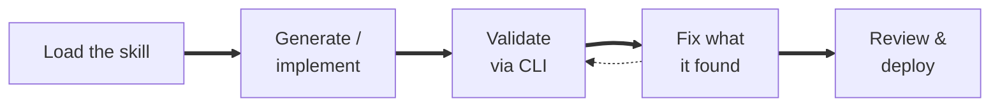

# Build: six blocks, six prompts, six proven components

Block 3 is deliberately **six separate runs, not one** — each piece is built and proven before the next one binds to it.

| Traditional UiPath delivery | With a coding agent and UiPath Skills |
|---|---|
| A developer builds each component in its designer — Studio, Agent Builder, the case designer — configures Orchestrator and Data Fabric by hand, tests at the end, and documents afterwards. | The agent builds each component through the `uip` CLI with the product's skill loaded, **validates and fixes before it reports**, and writes names and keys into `PROGRESS.md` as they appear. You direct and review. |

## The six blocks

| Block                                             | Builds                                                      | Done when                                                             | Go and look at             |
| ------------------------------------------------- | ----------------------------------------------------------- | --------------------------------------------------------------------- | -------------------------- |
| [3a · IXP Extraction](1-extract-the-documents.md) | The document extraction, adopted and proven                 | Two unseen forms come back complete from IXP, keys confirmed          | A payload beside its form  |
| [3b · Claim record](2-create-the-claim-record.md) | The **Data Fabric** entity                                  | Cents and a 9,000-character payload round-trip                        | The table, and a row in it |
| [3c · Agents](3-build-the-seven-agents.md)        | The seven **Agents**                                        | Each returns what the rules say, including *nothing* on a clean claim | One agent's trace          |
| [3d · Case](4-author-the-case.md)                 | The **Maestro** case plan, authored and validated (not run) | Both gates green; the plan opens in **Studio Web**                    | The case diagram           |
| [3e · Run](5-run-the-case.md)                     | The case deployed and proven live                           | A clean claim settles untouched; four human routes work               | A live instance            |
| [3f · Apps](6-build-the-review-screens.md)        | The **Coded Action App**'s two reviewer screens             | Both gates render; a decision writes back                             | Tasks in **Action Center** |

## How every block page works

**Problem → Prompt → Steps your agent will typically take → what to Review → Gate → Proof.** The same pipeline sits under every one of them:

The Validate → Fix loop is what Anthropic's [AI-Native SDLC playbook](https://claude.com/blog/the-ai-native-sdlc-playbook) calls giving the agent a way to verify its own work: a target it can check without asking you. Every *Done when* in the table above is one.

## "Done" means the next block can start

A block is not finished when its own artifact works — it is finished when the next block can stand on it. That is why every *done when* has two halves: the component proven, and its names, keys and one real example written into `PROGRESS.md`. The reader of that file is a fresh session with none of today in mind; agents should hand it what they actually got, never a sample.
