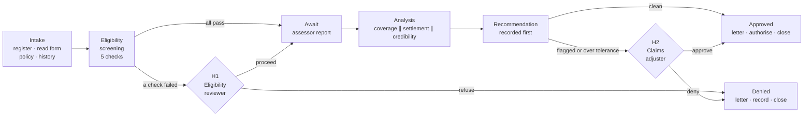

# The Property Claims Case

## The problem worth solving

A household property claim takes the claims team **95 minutes of handling and 15 business days of elapsed time** — most of it re-keying documents, emailing other departments and waiting, with a shared spreadsheet as the only view of what's in flight. The deterministic legwork is already automated: registering the claim, gathering documents, reading the form, fetching the policy and history, sending letters. What's missing is everything that needs *judgement* — and one process that links it all together, from filing to decision letter.

That judgement is the real work. As *The Work That Remains* puts it: strip out the exceptions and judgement calls and "you have not automated the work. You have automated a fiction of it."

## What arrives with a claim

Three documents — and only one of them is a form:

| Document | Structure | What it carries |
|---|---|---|
| **Claim form** | Structured — same layout every time | Claimant, property, policy number, incident date and type, the damage inventory with amounts |
| **Insurance policy** | Free-form contract prose, worded differently by every insurer | Limits, sublimits, deductible, exclusions, named perils, endorsements — the *only* authority on what this claim can pay |
| **Assessor report** | Free-form, written by an external contractor | The cause determination and an independent repair estimate |

Plus one lookup: the claims already settled against this policy this period. That distinction — one form, two prose documents — will shape the whole architecture: the form is read into fields once; the prose documents are read, clause by clause, by whatever does the judging.

## How a claim should be handled

Two human gates, and both are **skipped when there is nothing to decide**. Five screening checks run before an inspection is paid for; a reviewer sees them only if one failed. Three analyses run when the assessor report lands; an adjuster sees them only if something was flagged or the amount is out of tolerance. A claim with nothing wrong settles end to end with no human touch — that is the point, and it is measured.

## What success means

| Target | Measure |
|---|---|
| ≥ 30% of claims fully straight-through | no human touch at any point |
| ≤ 2 business days for a clean claim | receipt to decision letter |
| 100% detection | every claim with a known material problem stopped at the right gate, problem named |
| ≤ 10% false escalation | clean claims referred to a human anyway |

The last two pull against each other on purpose. Stopping every claim gives perfect detection and a useless process; never stopping one does the reverse. **The measure of your build is meeting both.**

## What can be wrong with a claim

The exercise's test claims are generated, and a generated claim can carry a planted problem — at most one for each gate, each owned by exactly one check:

| Caught at | The problem, as a claim carries it |
|---|---|
| Screening | The policy lapsed for non-payment before the loss — only the payment status gives it away |
| Screening | The claimant isn't the policyholder — same surname, same address, different person |
| Screening | The claim and policy addresses differ by a real digit, not by formatting |
| Screening | The loss happened outside the policy period |
| Screening | The claim was filed after the deadline — sometimes with a documented excuse, which is a caveat, not a failure |
| Review | Every figure sits 25–40% above the assessor's independent estimate |
| Review | The incident type on the form isn't the cause the assessor determined — even when both are covered |
| Review | The claimant's own account contradicts the cause they're claiming — nothing missing, nothing malformed, visible only to something that reads both and understands them |
| Review | An earlier claim this period ate most of the annual aggregate — the claim itself is spotless; the problem isn't in its documents at all |
| Review | The claims history is unreadable — which must be flagged, never treated as "no prior claims" |

**And roughly a third of claims carry nothing wrong.** Those must settle in full, untouched. In the PDD's own words: a process that finds something on every claim "has learned to always answer *yes* to *'is anything wrong here?'* — the easiest way to look thorough and the least useful."
