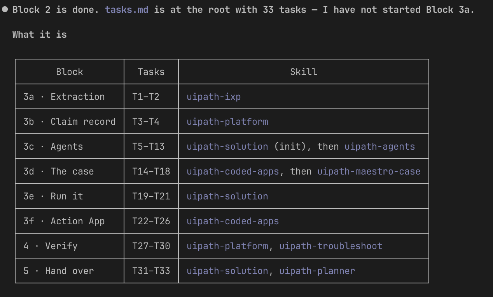

# Plan the Work (Block 2)

The design says what the solution *is*; ten minutes now decide the order it gets built in. This is the cheapest block of the day — and the one place ordering mistakes surface before anything is built, instead of halfway through an afternoon.

## The prompt

````markdown title="Prompt — block 2 · Plan"
--8<-- "seeds/2-plan/prompt.md"
````

Steps:

- [x] Load the uipath-planner skill
- [x] Derive `tasks.md` from `sdd.md` at the seed root
- [x] Order the tasks leaves-first: entity, agents, app registration all before the case
- [x] Put a `Validate:` step on every generating task and a test task before every deploy
- [x] Review top-to-bottom: nothing blocked by something further down
- [x] Update `PROGRESS.md`

## What a good plan looks like

- **Leaves before consumers.** Nothing binds to something unbuilt: the Data Fabric Claim Record before anything writes to it, the seven Agents before the Case Plan that calls them. The least obvious leaf is the review app's *contract* — the case binds it, so the app is registered (empty page and all) before the case exists, and its screens come last of all, after real runs have produced real data. You'll see why when you get there.
- **Routing, not re-description.** Each task names which skill builds it and which `sdd.md` sections to read — nothing more. A task that re-explains the architecture is a second copy of the design; two copies of one fact always end up disagreeing.
- **A check after every creation.** Every generating task carries a `Validate:` step, and a test task sits before anything deploys. The plan carries the discipline the build will be too busy for.

## Review the plan

Read it top to bottom once and ask two questions:

1. Could someone work this list without opening the design to find out what comes next?
2. Does every dependency point *up* the list? One "blocked by" pointing down means the order is wrong — and it is far cheaper to move a line now than to discover it mid-build.

One more habit this file carries: each later block sets the `Status:` line of the tasks it finishes. By the end of the day, a reader scanning the status lines sees exactly what was built and what was consciously skipped — the file degrades into the truth.

## Proof

Evidence from a real run of this block: 33 tasks, every one carrying a `Validate:` line, and no dependency pointing down the list. The first ten:

??? example "tasks.md — the first ten tasks (expand)"

    ```text
    Task T1 — uipath-ixp — Adopt the shared IXP project and capture two live extraction payloads
       blocked-by: none
       Validate: both payloads carry every field group with the damage rows repeating per item…

    Task T2 — uipath-ixp — Confirm every extraction key the design binds
       blocked-by: T1
       Validate: `check_extraction_keys.py` reports every design path resolved…

    Task T3 — uipath-platform — Create the claim entity ClaimCase_<seat> in the seat folder
       blocked-by: none
       Validate: the read-back schema matches `sdd.md` *Case Entity* on all 36 columns and their types

    Task T4 — uipath-platform — Prove the claim record round-trips, then delete the probe row
       blocked-by: T3
       Validate: all four values read back unchanged and the probe row is gone

    Task T5 — uipath-solution — Initialise the solution before the first project
       blocked-by: none
       Validate: `uip solution restore` succeeds against the empty solution

    Task T6 — uipath-agents — Build EligibilityScreening
       blocked-by: T2, T5
       Validate: the agent builds and publishes inside the solution, and one invocation on a real claim…

    Task T7 — uipath-agents — Build AssessmentReportValidation
       blocked-by: T2, T5
       Validate: the agent builds and publishes inside the solution, and one invocation returns all three…

    Task T8 — uipath-agents — Build CoverageAnalysis
       blocked-by: T2, T5
       Validate: the agent builds and publishes inside the solution, and one invocation returns both envelopes…

    Task T9 — uipath-agents — Build SettlementCalculation
       blocked-by: T2, T5
       Validate: the agent builds and publishes inside the solution, and the canonical claim in `sdd.md`…

    Task T10 — uipath-agents — Build CredibilityAssessment
       blocked-by: T2, T5
       Validate: the agent builds and publishes inside the solution, and one invocation returns four reads…
    ```

Read the shape, not just the rows: the extraction and the entity are leaves (`blocked-by: none`), every agent waits on the confirmed keys and the solution shell, and each task ends with the check that proves it. A list that runs top to bottom, from leaves to the case to the screens.

And the agent's own closing report of the block — the whole plan's shape, routed block by block to the skill that builds it. Note the last words: it stopped at the boundary rather than rolling into 3a:

{ .screenshot width="900" }

