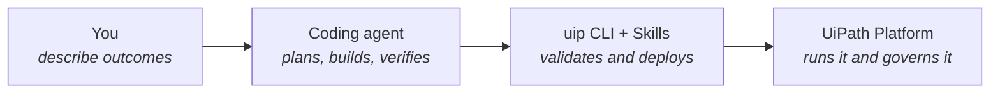
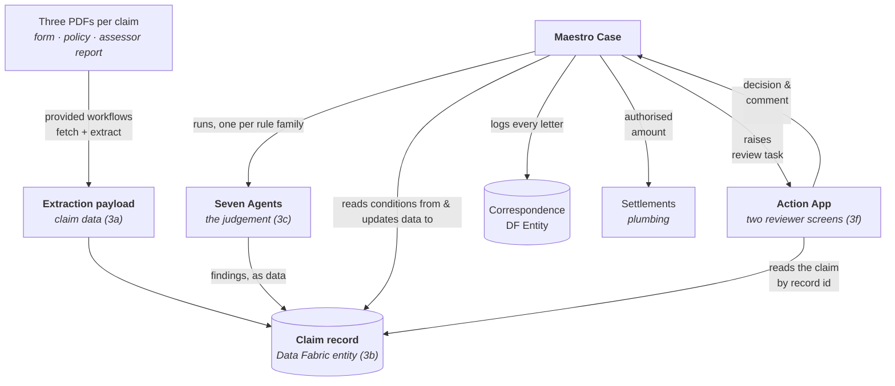

# Architecture Overview

You have a design and a plan. Before the build starts, here is the whole solution on one page — what each block adds, and how the pieces talk to each other. As you read, keep your own `sdd.md` open: everything on this page should be findable in it, and anything that isn't is worth a second look before block 3a.

## How you build it

One chain runs the whole workshop:

You never leave this loop: every component below is built by your agent through the CLI, and proven on the platform.

## What you build, and how it connects

| Block | Produces                                                        | Consumed by                                                                                                   |
| ----- | --------------------------------------------------------------- | ------------------------------------------------------------------------------------------------------------- |
| 3a    | The **extraction payload** and its exact **field keys**         | The **agents' inputs** and the **case's bindings**                                                            |
| 3b    | The **Claim Entity** record                                     | **Everything**: Agents write findings to it, the Case Plan routes on it, the Action Apps read it              |
| 3c    | Seven **Agents' outputs** (flags, risk levels, amounts)         | The **Case's gate conditions**, the Data Fabric Claim Record, and ultimately the reviewer's Action App screen |
| 3d    | The **Case Plan** and the app's registered *contract*           | The **run block** (3e); the contract is what lets the case wire both gates before any screen exists           |
| 3e    | A deployed, proven case and **payloads** populated by real runs | The **Action App screens** are built against these payloads produced by your deployment                       |
| 3f    | The reviewer Action App screens                                 | The **humans** at H1 and H2. The key part of your build that you will see and validate                        |

## Two layers worth naming

Your `sdd.md` and the contracts are **the map** — the shared description every component is built against; the deployed case, processes and record are **the rails** — the deterministic layer that actually touches the world. Judgement lives in the seven Agents, and decision sits behind the two human gates. Everyone reads the same map.

## Why this decomposition

Each component is the smallest thing that can be built and proven alone: the payload before the record, the record before the agents, the agents before the case that binds them, the case before the screens that render what its runs produced. Six blocks, each one leaving something the next can stand on — which is exactly what your `tasks.md` already says.
