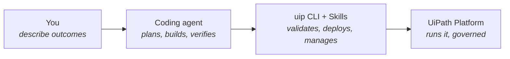
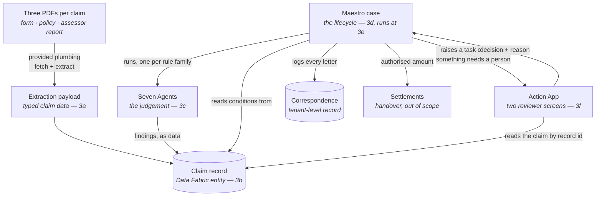

# Architecture Overview

You have a design and a plan. Before the build starts, here is the whole solution on one page — what each block adds, and how the pieces talk to each other. As you read, keep your own `sdd.md` open: everything on this page should be findable in it, and anything that isn't is worth a second look before block 3a.

## How you build it

One stack runs the whole workshop:

You never leave this loop: every component below is built by your agent through the CLI, and proven on the platform.

## What you build, and how it connects

| Block | Produces | Consumed by |
|---|---|---|
| 3a | The extraction payload and its exact field keys | The agents' inputs and the case's bindings — a wrong key fails silently, which is why 3a ends with a key check |
| 3b | The claim record | Everything: agents write findings to it, the case routes on it, the screens read it, verify judges by it |
| 3c | Seven Agents' typed outputs — flags, risk levels, amounts | The case's gate conditions, the record, and ultimately the reviewer's screen |
| 3d | The case plan — and the app's registered *contract* | The run block; the contract is what lets the case wire both gates before any screen exists |
| 3e | A deployed, proven case; records populated by real runs | The screens are built against these payloads; verify aims runs at this deployment |
| 3f | The two reviewer screens | The humans at H1 and H2 — the only part of your build anyone will ever see |

## Two layers worth naming

Borrowing *The Work That Remains*' vocabulary: your `sdd.md` and the contracts are **the map** — the shared description every component is built against; the deployed case, processes and record are **the rails** — the deterministic layer that actually touches the world. Judgement lives in the seven Agents, and consequence sits behind the two human gates. Everyone reads the same map; only the rails touch the world.

That split is visible in where each fact lives:

- **What a finding *is*** — an Agent's prompt and typed output schema (3c)
- **What happens *because* of a finding** — a case condition over that output (3d); routing is never a sentence in a prompt
- **What a human *sees and decides*** — the task contract and the screens (3d registers it, 3f fills it)

## Why this decomposition

Each component is the smallest thing that can be built and proven alone: the payload before the record, the record before the agents, the agents before the case that binds them, the case before the screens that render what its runs produced. Six blocks, each one leaving something the next can stand on — which is exactly what your `tasks.md` already says.
