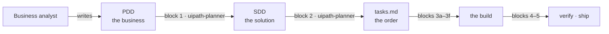

# Plan

Before anything is built, three documents decide what gets built. This section walks you through them — the one you receive, and the two your agent generates.

## The method: PDD → SDD → tasks

| Document | The question it answers | Written by | Read by |
|---|---|---|---|
| **PDD** — Process Definition Document | *What does the business do, and what must stay true?* | A business analyst, with the process owner | The solution architect — and every design decision traces back to it |
| **SDD** — Solution Design Document | *What is the solution, when it runs?* | The **uipath-planner** skill, driven by your agent (block 1) | Every build block — everything downstream binds to it |
| **tasks.md** — the implementation plan | *What gets built, in what order, checked how?* | The same skill (block 2) | You and your agent, top to bottom, all day |

Each document exists so the next one has nothing to guess. The SDD is written once and pays off twice: it is the specification the build follows, and afterwards it is the description of what actually runs — which is why the last block brings it to *as-built* rather than archiving it.

The public UiPath docs describe the same journey as a five-phase [automation lifecycle](https://docs.uipath.com/coding-agents/standalone/latest/user-guide/overview) — discovery and planning, building, verification, troubleshooting, running. This workshop walks the same path with the documents made explicit.

!!! info "Coming: a PDD that writes itself"
    In this workshop the PDD is given. In a real engagement, drafting it is real work — and **UiPath Cartographer**, in public preview since August 2026, does exactly that: feed it transcripts, SOPs or recordings, and it drafts the AS-IS and TO-BE process maps and generates the PDD, ready for the flow you are about to practice.

## In this section

| Step | What it covers |
|---|---|
| [1. The Property Claims Case](1-the-property-claims-case.md) | The business problem, the documents, and what can be wrong with a claim |
| [2. Read the PDD](2-read-the-pdd.md) | A guided tour: where the load-bearing details live |
| [3. Design the Solution](3-design-the-solution.md) | Block 1 — your agent generates the SDD, and a gate checks it |
| [4. Plan the Work](4-plan-the-work.md) | Block 2 — the SDD becomes an ordered task list |
| [5. Architecture Overview](5-architecture-overview.md) | The whole solution on one diagram, before the build starts |
