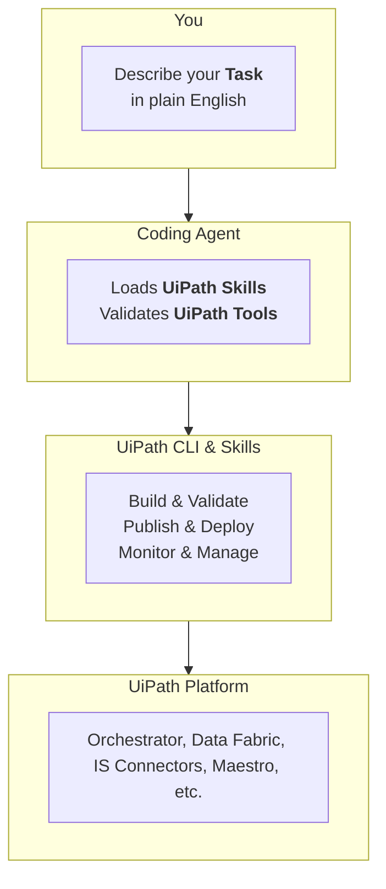

# Prepare Your Tools

!!! tip "Here is our plan for this lesson:"

    1. Check what you already have — CLI, sign-in, skills.
    2. Install whatever is missing.
    3. Verify that your agent recognizes UiPath tasks.

## Goal

A working setup before the exercise starts: the latest `uip` CLI installed and authenticated, the UiPath skills added to your coding agent, and one quick check that proves the agent knows how to build with UiPath. If you have done a UiPath coding-agents session before, this page is a five-minute checkup.

## Why a coding agent changes how you build

A coding agent already knows how to write code, out of the box. What it doesn't know is UiPath platform: CLI commands, components and UiPath code structures, and platform conventions. 

[[[
Two pieces fix that:

- **UiPath CLI** (`uip`) is the interface the agent uses to talk to the platform. A command-line interface turned out to be the most token-efficient way to expose UiPath to an agent.
- **Skills** teach the agent to use that CLI well. Each one packs product context, commands, validation rules and best practices — so you ask for an outcome instead of memorizing command sequences.
- Together with your session and permissions, this wrapper around the agent is the **harness** — the controlled environment of **context**, **tools** and **checkpoints** an agent works inside. You are about to assemble one.
|50|

]]]

## Steps

### 1. Check what you have

```bash
uip --version
uip login status
uip tools list
uip skills list
```

If all three answer sensibly, skip to step 5. Otherwise, do only the steps you're missing.

### 2. Install the UiPath CLI

Install the CLI globally. This gives you the `uip` command.

```bash
npm install -g @uipath/cli
```

### 3. Sign in

Authenticate once in browser. Your coding agent reuses this same session, so it acts as you on the platform.

```bash
uip login
```

### 4. Install the UiPath skills

`uip skills install` adds the skills to the agent you name:

=== "Claude Code"

    ```bash
    uip skills install --agent claude
    ```

    Skills install globally for Claude Code (the `--local` flag is for other agents). Restart Claude Code afterwards so it reloads plugins.

=== "Codex"

    ```bash
    uip skills install --agent codex
    ```

=== "OpenCode"

    ```bash
    uip skills install --agent opencode
    ```

The installer walks you through selecting skill bundles. Pick the ones this workshop uses — the exact list is in the seed's `CONFIG.md`.

!!! info "Good to know"
    The skills registry is [public on GitHub](https://github.com/UiPath/skills), so this step needs no login. You don't need to install platform tools first either — your agent auto-installs them on first use.

A few commands to keep handy:

```bash
uip login status
uip --version
uip update
uip tools update
uip skills update
```

`uip --help` and `uip <command> --help` are your best friends, right after your coding agent.

### 5. Verify the setup

Run your agent with the skills installed and ask it for an outcome — not a command:

```text
which uipath skills I can use? can you list tenants within environments I'm connected to?
```

[[[
A correctly set-up agent will use the tools and give you the answer. If it doesn't recognize UiPath tasks, restart your coding agent once so it reloads plugins.
|30|
{ .screenshot }
]]]

## One identity, your identity

!!! info "Sessions, security, and what the agent may do"
    Everything the agent does goes through the `uip` CLI, and the CLI is signed in as exactly **one identity — yours**. It cannot reach anything your account cannot reach; there is also no setting that makes it safer than your account. Three habits follow:

    - **Approve commands as they come.** Avoid a blanket **uip** allow rule — it also covers destructive commands. Read/list prefixes are fine to approve permanently.
    - **Keep secrets out of prompts and project files.** Credentials belong in a secret store, never in the conversation.
    - **Review before you deploy.** A coding agent does not validate the compliance of generated code — that stays your job.

    Some agents run commands in isolated environments and may not see your real session. If `uip login status` works in your terminal but the agent says otherwise, tell it: *"When using the UiPath CLI, prefer escalated execution because sandboxed commands may not reflect my real terminal session."*

## Read more

| Official page | What it covers |
|---|---|
| [Coding agents overview](https://docs.uipath.com/coding-agents/standalone/latest/user-guide/overview) | The mental model: agent + CLI + skills |
| [Working effectively](https://docs.uipath.com/coding-agents/standalone/latest/user-guide/working-effectively) | Best practices for driving an agent on UiPath |
| [Governance and trust](https://docs.uipath.com/coding-agents/standalone/latest/user-guide/governance-and-trust) | Identity, permissions, telemetry |
| [Managing tools and skills](https://docs.uipath.com/uipath-cli/standalone/latest/user-guide/managing-tools-and-skills) | Install, update and pin skills per agent |

Done. Your tools are ready.
