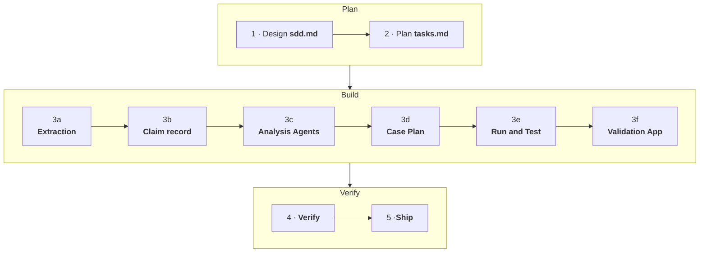

# How the Workshop Runs

One rhythm: a prompt goes in, an action or a component comes out, a gate checks it, and you go look at what was built.

## The path through the day

The exercise is ten blocks. The first two design and plan; six build; two verify and ship:

The seed numbers the blocks and this guide groups them into its sections the same way. Block 3 is six separate runs, not one: each piece is built and proven before the next starts.

## How a block works

|                 | What happens                                                                                |
| --------------- | ------------------------------------------------------------------------------------------- |
| **The prompt**  | Each block page shows the exact prompt. Give it to your agent.                              |
| **The build**   | The agent works. Block page's *Steps* checklist shows what it will typically do.            |
| **The gate**    | A script or platform check the block must pass before you move on.                          |
| **Go and look** | Open the thing that was built: a payload, a table row, a trace, a diagram, a live instance. |

## Gates: commands, not opinions

Every block ends with something that passes or does not. That is deliberate — a plausible-looking result is not a result.

- **A gate is a baseline or floor, not a perfect result.** An agent's review can grade a broken component an A: grades check structure and wording. Agents sometimes say "Done" without actually doing task till the end. The gate catches the key deliverables; *go and look* catches the rest.
## Context is a resource

A coding agent's context window fills, and what was never written down does not survive it.

- **Clear context at block boundaries** — `/clear` or start a fresh session. With a large context window multiple blocks fit in one session; with a smaller one, clear after every block. Below is the exact table.
- **`PROGRESS.md` is the memory between sessions.** Every block appends names, keys and decisions the moment they exist — the next session resumes from the file, not from recollection.
- **Upload the solution at the end of every block** — everything the agent builds is local until then, and the upload is what lets you *go and look* in Studio Web.

## Driving your agent well

Five habits, whatever agent you brought:

1. **Be specific.** A complete brief beats a long prompt — the seed's prompts are the model.
2. **Ask for a plan first** on anything non-trivial; redirect before files change, not after.
3. **Iterate.** The first version is good; the second is usually better. Two or three passes, not ten.
4. **Course-correct early.** Interrupt the moment you see a wrong turn — waiting costs a rebuild.
5. **Verify outcomes yourself.** The agent's "done" message is its opinion; the gate and your own eyes are the evidence. Especially on lighter models.

## Agents are instructed to log findings

When something surprises them — a command that lies, a document that contradicts another, a step that only worked the second way — they log it with `log-finding.py`. It takes a second but helps to align the prompts with current version of skills and tools.

## How long the blocks run

Expect your coding agent to run roughly this long per block — your own review time comes on top:

| Block             | Agent runtime |                                                    |
| ----------------- | ------------- | -------------------------------------------------- |
| 1 · Design        | 15–30 min     |                                                    |
| 2 · Plan          | 10–15 min     |                                                    |
| 3a · Extraction   | 15–30 min     |                                                    |
| 3b · Claim record | 10–20 min     |                                                    |
| 3c · Agents       | 1–2 h         | **large**                                          |
| 3d · Case         | 1–2 h         | **large**                                          |
| 3e · Run          | 1–2 h         | **large** (several deploy cycles is normal)        |
| 3f · Screens      | 1–2 h         | **large**                                          |
| 4 · Verify        | 2–4 h         | **largest** (most of it is fixing and fine tuning) |
| 5 · Ship          | 10–20 min     |                                                    |

!!! note
    These are expectations, not promises — agents evolve and models differ, and a block that hits a real defect runs longer.
