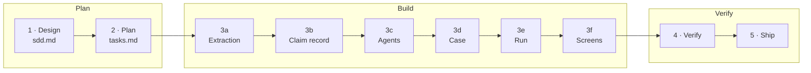

# How the Workshop Runs

One rhythm carries the whole day: a prompt goes in, a component comes out, a gate checks it, and you go look at what was built. This page is that rhythm — read it once now, and the build pages will feel familiar all day.

## The path through the day

The exercise is ten blocks. The first two design and plan; six build; two verify and ship:

The seed numbers the blocks; this site groups them into its sections the same way — blocks 1–2 in **Plan**, 3a–3f in **Build**, 4–5 in **Verify**. Block 3 is six separate runs, not one: each piece is built and proven before the next starts.

## How a block works

| Beat | What happens |
|---|---|
| **The prompt** | Each block page shows the exact prompt — copy it into your agent, in the seed folder |
| **The build** | The agent works; the page's *Steps* checklist shows what it will typically do |
| **The gate** | A script or platform check the block must pass before you move on |
| **Go and look** | Open the thing that was built — a payload, a table row, a trace, a diagram, a live instance |

## Gates: commands, not opinions

Every block ends with something that passes or does not. That is deliberate — a plausible-looking result is not a result.

- **A gate is a floor, not a finish.** An agent's review can grade a broken component an A: grades check structure and wording, not the pipeline. The gate catches the boring half; *go and look* catches the rest.
- **Read the gate's rules even when it passes.** Each rule is a shape that built and then failed — a designer who reads them writes fewer of them.
- **Never edit a document just to satisfy a rule you believe is wrong.** Say so and log it — a wrong rule is worth more to the maintainers than a compliant file.

## Trust, but count

Your agent will tell you it did something. "Success" is a claim about the *request*, not about the result — a call can be accepted while half its contents were refused.

- After any operation that matters, ask the system what it now contains: count the rows, list the deployments, open the page.
- Prefer claims you can check: *"the table holds 31 findings"* beats *"logged 31 findings"*.

## Context is a resource

A coding agent's context window fills, and what was never written down does not survive it.

- **Clear context at block boundaries** — `/clear` in Claude Code; in Codex or OpenCode, start a fresh session. With a very large context window the first two blocks fit in one session; with a smaller one, clear after every block. The seed's `README.md` carries the exact table.
- **`PROGRESS.md` is the memory between sessions.** Every block appends names, keys and decisions the moment they exist — the next session resumes from the file, not from recollection.
- **Upload the solution at the end of every block** — everything the agent builds is local until then, and the upload is what lets you *go and look* in Studio Web.

## Driving your agent well

Five habits, whatever agent you brought:

1. **Be specific.** A complete brief beats a long prompt — the seed's prompts are the model.
2. **Ask for a plan first** on anything non-trivial; redirect before files change, not after.
3. **Iterate.** The first version is good; the second is usually better. Two or three passes, not ten.
4. **Course-correct early.** Interrupt the moment you see a wrong turn — waiting costs a rebuild.
5. **Verify outcomes yourself.** The agent's "done" message is its opinion; the gate and your own eyes are the evidence.

## Findings are part of the deliverable

When something surprises you — a command that lies, a document that contradicts another, a step that only worked the second way — log it with the seed's `log-finding.py`. It takes a minute, it is what makes the next cohort's seed better, and it is the only record afterwards of what the build actually cost. Logging findings is not homework; it is the work.

## How long the blocks run

Expect your coding agent to run roughly this long per block — your own review time comes on top:

| Block | Agent runtime | |
|---|---|---|
| 1 · Design | 15–30 min | |
| 2 · Plan | 10–15 min | |
| 3a · Extraction | 15–30 min | |
| 3b · Claim record | 10–20 min | |
| 3c · Agents | 1–2 h | **large** |
| 3d · Case | 1–2 h | **large** |
| 3e · Run | 1–2 h | **large** — several deploy cycles is normal |
| 3f · Screens | 1–2 h | **large** |
| 4 · Verify | 2–4 h | **largest** — most of it is fixing, not measuring |
| 5 · Ship | 30–60 min | |

!!! note
    These are expectations, not promises — agents and models differ, and a block that hits a real defect runs longer. The large blocks are where context discipline matters most.
