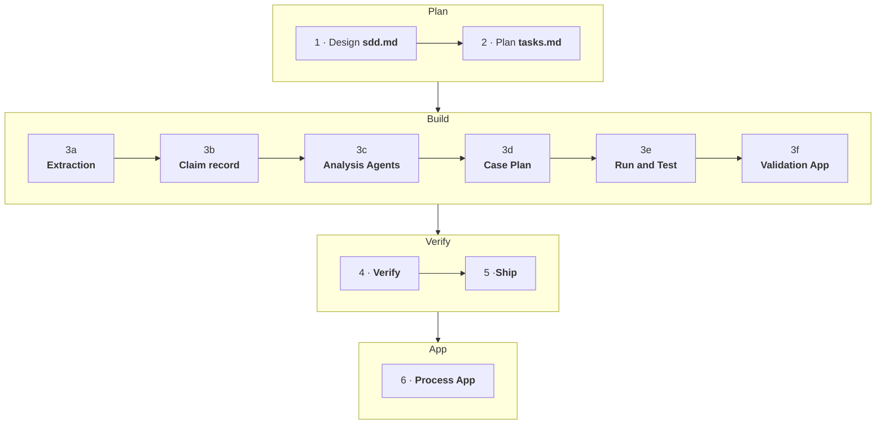

# How the Workshop Runs

Every block follows the same rhythm: a prompt goes in, an action or a component comes out, a gate checks it, and you go and look at what was built.

## The path through the day

The exercise is eleven blocks. The first two design and plan; six build; two verify and ship; the last builds the portfolio view:

```mermaid
flowchart TD
    subgraph P ["Plan"]
        direction LR
        D["1 · Design <b>sdd.md</b>"] --> PL["2 · Plan <b>tasks.md</b>"]
    end

    subgraph B ["Build"]
        direction LR
        A3["3a<br><b>Extraction</b>"] --> B3["3b<br><b>Claim record</b>"] --> C3["3c<br><b>Analysis Agents</b>"] --> D3["3d<br><b>Case Plan</b>"] --> E3["3e<br><b>Run and Test</b>"] --> F3["3f<br><b>Validation App</b>"]
    end

    subgraph V ["Verify"]
        direction LR
        V4["4 · <b>Verify</b>"] --> S5["5 ·<b>Ship</b>"]
    end

    subgraph AP ["App"]
        direction LR
        A6["6 · <b>Process App</b>"]
    end

    %% Direct vertical connections between the blocks
    P --> B
    B --> V
    V --> AP
```    
The seed numbers the blocks and this guide groups them into its sections the same way. Block 3 is six separate runs, not one: each piece is built and proven before the next starts.

## How a block works

|                 | What happens                                                                                |
| --------------- | ------------------------------------------------------------------------------------------- |
| **The prompt**  | Each block page shows the exact prompt. Give it to your agent.                              |
| **The build**   | The agent works. The *Steps* checklist on each block page shows what it typically does.     |
| **The gate**    | A script or platform check the block must pass before you move on.                          |
| **Go and look** | Open the thing that was built: a payload, a table row, a trace, a diagram, a live instance. |

## Gates: commands, not opinions

Every block ends with a check that passes or fails, because a result that only looks right has not been proven.

- **A gate is a floor, not a perfect result.** An agent's review can grade a broken component an A: grades check structure and wording. Agents sometimes report "done" before the task is finished. The gate catches the key deliverables; *go and look* catches the rest.
- **Skills steer; gates check.** Anthropic's [AI-Native SDLC playbook](https://claude.com/blog/the-ai-native-sdlc-playbook) draws the same line for any coding agent: a skill is an advisory control that makes a mistake rare, and a deterministic check behind it makes the mistake close to impossible. The UiPath Skills steer your agent; the seed's gate scripts are the check.

## Managing context between blocks

A coding agent's context window fills, and what was never written down does not survive it.

- **Clear context at block boundaries.** Run `/clear` or start a fresh session. With a large context window, several blocks fit in one session; with a smaller one, clear after every block.
- **`PROGRESS.md` is the memory between sessions.** Every block appends names, keys and decisions the moment they exist, so the next session resumes from the file, not from recollection.
- **Upload the solution at the end of every block.** Everything the agent builds stays local until then, and the upload is what lets you *go and look* in Studio Web.

## Driving your agent well

Five habits, whatever agent you brought:

1. **Be specific.** A complete brief beats a long prompt; the seed's prompts show what one looks like.
2. **Ask for a plan first** on anything non-trivial; redirect before files change, not after.
3. **Iterate.** The first version is good; the second is usually better. Plan for two or three passes, not ten.
4. **Course-correct early.** Interrupt the moment you see a wrong turn; waiting costs a rebuild.
5. **Verify outcomes yourself.** The agent's "done" message is its opinion; the gate and your own eyes are the evidence, especially on lighter models.

## Agents are instructed to log findings

When something surprises them (a command that lies, a document that contradicts another, a step that only worked the second way), they log it with `log-finding.py`. It takes a second, and the findings are how the prompts keep up with new versions of the skills and tools.

The playbook has a working rule for this: when an agent makes the same mistake twice, the correction goes into a file it reads at the start of every session. The seed applies it throughout, and every cookbook row is a correction met on a real build.

## How long the blocks run

Expect your coding agent to run roughly this long per block, plus your own review time:

| Block             | Agent runtime |                                                          |
| ----------------- | ------------- | -------------------------------------------------------- |
| 1 · Design        | 20–45 min     |                                                          |
| 2 · Plan          | 5–15 min      |                                                          |
| 3a · Extraction   | 5–15 min      |                                                          |
| 3b · Claim record | 5–15 min      |                                                          |
| 3c · Agents       | 45–75 min     | **large**                                                |
| 3d · Case         | 30–60 min     | **large**                                                |
| 3e · Run          | 30–75 min     | **large** (several deploy cycles are normal)             |
| 3f · Screens      | 45–75 min     | **large**, plus your review of the local screens         |
| 4 · Verify        | 1–2 h         | **largest** (three fix cycles, then one scored batch)    |
| 5 · Ship          | 15–30 min     |                                                          |
| 6 · Process App   | 45–60 min     | plus your signed-in check                                |

!!! note
    These are expectations, not promises. Agents evolve, models differ, and a block that hits a real defect runs longer.

    **Reasoning effort:** in the most recent reference runs, a medium effort setting reached the same result as a maximum one on every block, with about 60% of the tokens. Raise it when a block stalls on the same failure twice, not by default.
