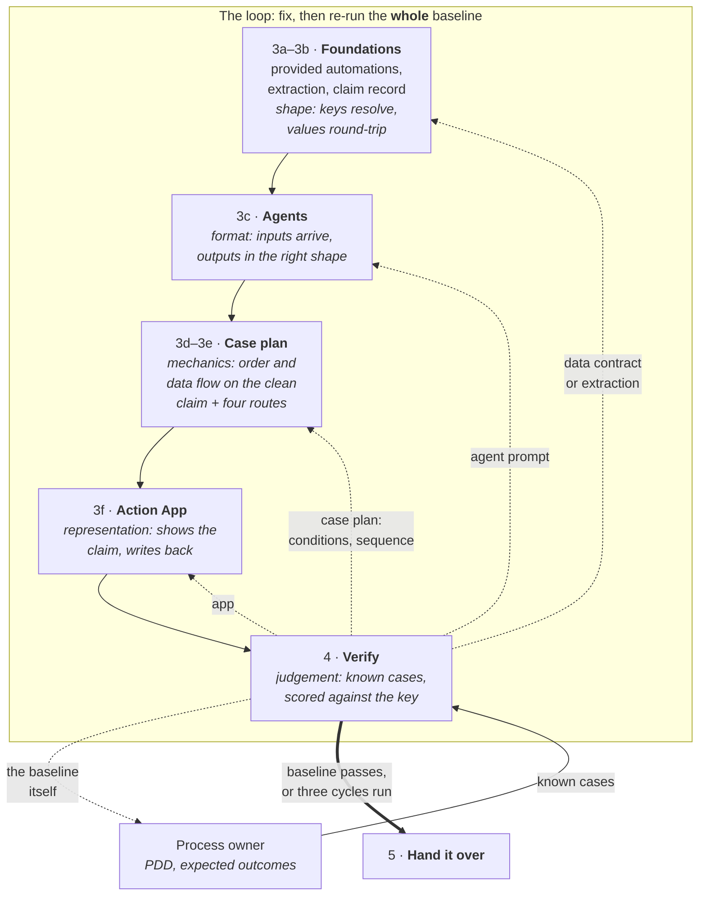

# Verify

Every piece was checked as you built it. This section answers the only question left — **does the whole thing work?** — and then hands the solution over in a state someone else can run.

## What each stage proves

A claims case runs for days and crosses seven Agents, a case plan, a data record and two human gates. No single test can see all of that, so the build tested in layers: each stage proved one thing, and deliberately not the next.

- **Format is not meaning.** Each Agent ran on one real claim, and you read its payload. That proves the inputs arrive and the output has the right shape — not that the analysis holds.
- **Mechanics are not judgement.** Five steered runs prove the stages fire in order and data flows between them — not that the case picks the right route on its own.
- **Representation is not correctness.** A faithful screen shows a wrong finding just as faithfully.

That is why every earlier block can pass while the judgement is still wrong. Verify is the only stage that looks at the whole.

## Testing a long-running process

Across those stages you used three kinds of check, each with its own blind spot:

| Kind               | Examples you've used                                            | What it can see                                       | What it cannot                                       |
| ------------------ | --------------------------------------------------------------- | ----------------------------------------------------- | ---------------------------------------------------- |
| **Offline gates**  | `check_sdd.py`, `check_extraction_keys.py`, `check_caseplan.py` | Shape, references, keys — before anything is deployed | Whether the thing behaves                            |
| **Platform gates** | `uip maestro case validate`, agent validation                   | What the runtime will refuse to load                  | What loads fine but misbehaves                       |
| **Live runs**      | The clean claim, the four routes                                | Real behaviour, one path at a time                    | Whether *every* path behaves. That's **this** block. |

- **Every gate is a floor.** A schema validator knows the document is well-formed; a grader knows it is well-written. Neither knows **what you are building**, and both will pass a component that cannot work.
- **The seams need their own checks.** Where one stage produces and the next consumes, neither side checks the handover — the producer has finished, the consumer was told to trust. Unit-proven pieces can still compose into a wrong whole.

## The baseline comes from the process owner

- **Known cases are the test.** In a real engagement the SME or process owner supplies them: claims with known problems, and the outcome each should reach. That set is your baseline; the PDD's §13.2 is the start of one.
- **More samples, more trust.** The baseline keeps growing as production finds cases nobody predicted: every production incident becomes a new case, and the whole set re-runs whenever a prompt, a case condition or the model changes.
- **Here, the claim generator stands in.** Its planted problems are the known cases; its answer key holds the expected outcomes.

## Fix, then re-run the whole baseline

| Traditional UiPath delivery | With a coding agent |
|---|---|
| Testers write the cases by hand; UAT with the business comes near the end, and a fix is re-tested where it was made. | The process owner's known cases are the baseline. The agent re-runs **the whole batch after every fix**, scored against the expected outcomes. |

In a real engagement the stage does not stop until **every baseline case passes on the same build**. In this workshop it runs **three fix cycles** — a whole batch, every fix it shows, one redeploy — then scores one last batch: each planted problem caught by its owner or listed with the fix it still needs, and clean claims inside the PDD's tolerance of one in ten referred to a human. The hand-over opens with that scorecard. After each fix, re-run all of it, not just the case that failed — fixes mask each other. A claim escalated for the wrong reason still reaches a human; close that reason, and a missed problem goes straight through. Detection and restraint pull against each other (PDD §1.3), so measure both on one batch.

Each failure goes back to the layer at fault:

| Verify found                                             | Where the fix lands                                                                                              |
| -------------------------------------------------------- | ---------------------------------------------------------------------------------------------------------------- |
| An Agent judged wrong                                    | Its prompt — then rebuild and re-run                                                                             |
| A wrong conclusion sends a claim to a human, or past one | A **case condition**, not more prompt revisions: *a prompt governs what an agent reports, not what it concludes* |
| A claim took the wrong path                              | The case plan — its conditions or its sequence                                                                   |
| A screen misrepresents the claim                         | The app                                                                                                          |
| A value lost or cut on the way                           | The data contract or the extraction                                                                              |
| The test itself is wrong or ambiguous                    | Back to the process owner — the PDD rule or the expected outcome                                                 |

When the answer key and the PDD disagree, the PDD decides — and sometimes a rule's wording admits two readings. Only the process owner can say which the business meant.

Two questions from *The Work That Remains* make a good standing review of any design, this one included: *who supplies the checker here?* — and *what part of the system guarantees correctness when correctness is required?* If the answer to the second is "the model," the architecture is unsafe. Here, the process owner's baseline answers the first; case conditions and the human gates answer the second.

## In this section

| Step                                                           | What it covers                                                                       |
| -------------------------------------------------------------- | ------------------------------------------------------------------------------------ |
| [1. Hunt the Planted Problems](1-hunt-the-planted-problems.md) | Block 4 — clean claims first, then one aimed run per problem, scored against the key |
| [2. Hand It Over](2-hand-it-over.md)                           | Block 5 — pins, the as-built design, and a runbook for whoever runs it next          |
